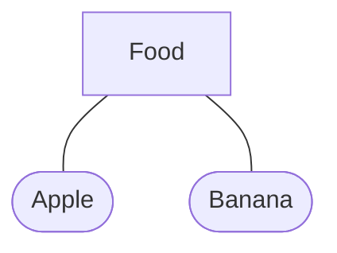
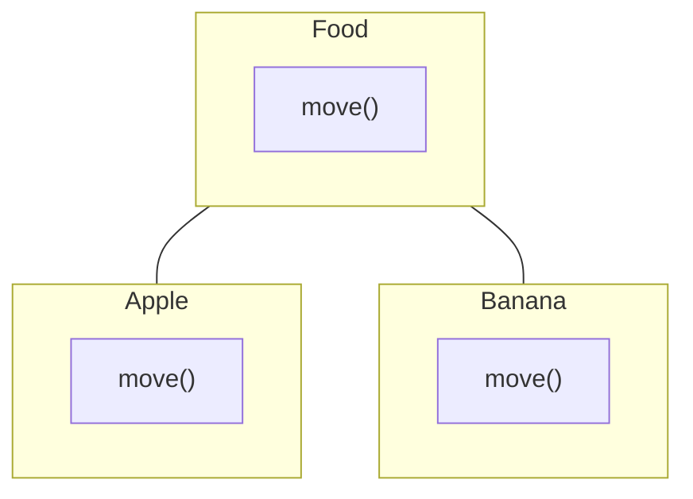

# Hungry Animal Game - Group E

## Concepts
### Abstract Classes & Polymorphism
We demonstrate the concept of abstract classes in the class `Food` as shown below.

The `Food` class is abstract, meaning we will never instantiate it directly. 
Instead, we create instances of its subclasses, such as `Apple` or `Banana`. 
The `Food` class represents anything the Elephant can eat, and each food item can each have a unique value indicating how many points it awards to the player.

### Overrides

In the `Food` class, we define an abstract method `move()`, which is overridden by its subclasses `Apple` and `Banana`. This allows each type of food to have a unique movement speed.

### Interfaces
The interface `Moveable` says the implemented classes (`Elephant` and `Food`) must define certain behaviour, in this case, a `move()` method. This is helpful as we can be certain that any class that implements `Moveable` can be moved in the same way.

